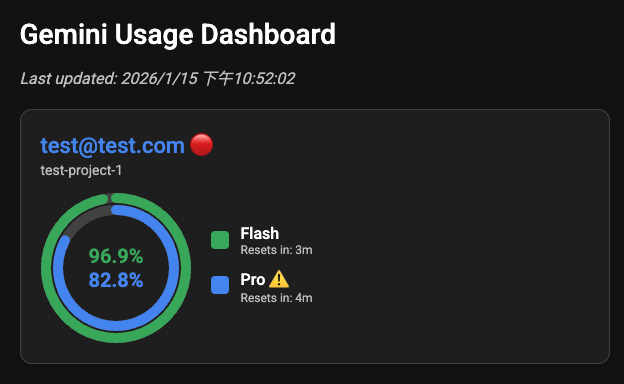

# Gemini CLI Mebsuta

  
This project is a web-based dashboard that displays Gemini API usage statistics.  
It provides a clear overview of the remaining quota for different Gemini models, tracks multiple accounts, and offers a visual representation of usage data.  

Despite of the visualization, a switchover mechanism is provided for multi-account setup when the "Pro" request is nearly empty.

## Tested Environment
The project is tested on a Mac, with 2 personal OAuth account.

## Getting Started
### Prerequisites

- Docker installed

### Installation

1. **Clone the repository**

2. **Build the image**
   ```
    docker build . -f Dockerfile.bun -t gemini-mebsuta // This is for bun based image
    docker build . -f Dockerfile.node -t gemini-mebsuta // This is for node based image
   ```

### Creating the environment
1. **Create an alias for the script**
This is a necessary step to provide switchover functionality by running the script first and finally run `gemini`. You can ignore this step if you use it as a dashboard only.
```
    alias gemini="/path/to/the/repo/script/gemini.sh"
```
You could also presist it with your shell rc file.

2. **Create an folder storing the account collection**
Please create a folder like `/path/to/your/.gemini-collection` that stores the different accounts login on your computer.  
To add a account to be visible in this project, please copy all the content in `~/.gemini` and use `GOOGLE_CLOUD_PROJECT` associated with the account as the folder name when you have login to the `gemini-cli`.

For example, `GOOGLE_CLOUD_PROJECT` should look something like `dogwood-tape-103842-r5`  
and you need to put the content of `~/.gemini` to `/path/to/your/.gemini-collection/dogwood-tape-103842-r5`

3. **Run the server:**
You need to mount your local `.gemini-collection` and `.gemini` directories into the container so the application can access your account information.
```
    docker run -p 3000:3000 -v /path/to/your/.gemini-collection:/.gemini-collection -v ~/.gemini:/.gemini gemini-mebsuta
```
**Note:** If you change the exposed port, please update your `script/gemini.sh` also.

## Environment Variables

You can configure the application using the following environment variables:
- `REMAINING_USAGE_THRESHOLD`: The percentage of remaining Pro quota at which an account is considered "low" and will suggest a switchover. Defaults to `10`.

## Notice
- The account switchover will be performed only on the next `gemini-cli` start, not during the `gemini-cli` execution.
